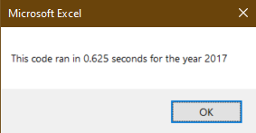

# Stock Tickers: Revenge of the Tick(er) with VBA

## Overview of Project
  As Steve had found out during the module that his parents' stocks in Daqo have dropped over 63% in 2018 and wanted to help them make a better investment. The module and challenge had made use of the data that Steve had collected in order to provide a basis on how to create helpful macros to organize, format, and calculate data without having to implement the GUI at every step and accomplish these tasks in a timely manner.

### Purpose
  Utilizing VBA in Excel makes calculating, formatting and organizing data happen at the _click_ of a macro button. Without the use of such macros, the time taken to go through each task with the GUI provided manually would take far longer. It is a fair go to remember the common adage that "time is money".
    
  In the case of Steve and his parents, using VBA macros can help them see the ups and downs of the stock market in a fraction of a second. Giving them much more time needed to deliberate on which to invest in!

## Analysis
### Stocks of 2017
  In the case of 2017, it was an overall good year for the stocks that they had gathered data for. With every one improving their year end value, except for the ticker, TERP. With the value of return from Steve's parents' stake in DQ proving to be nearly **_200%_** more than it was at its starting price. However, its total daily volume was the lowest of every other ticker there.
   
  The initial inspection on what Steve's parents' had invested in was great! Having a phenomenal return at year's end.

  
### Stocks of 2018
  However, looking at the performance in 2018 shows a different story. The only profitable stocks of that year, based on the return, was _ENPH_ and _RUN_. All others had a downward slope from the upwards trend of last year.
  
  The investment in DQ was now down 63%. It was time to find new stocks to invest, as well as to diversify, in order to provide a more secure return, come 2019.
  

   
  As far as the code I ended up writing for Steve and his parents', it turned out pretty well. The original code created during the course of the module would calculate and format the data in a little over half a second, floating around .6 seconds. When it came time to do the challenge and refactor the macro, it dropped nearly **_five tenths_** of a second for both 2017 and 2018, reaching around **_.1_** seconds to execute. That is a considerable improvement on the code's efficiency and truly satisfying to see the results.

## Challenges and Difficulties Encountered
### Arrays in name
  These improvements did not come freely however. It came at the cost of a few hours of stress and some slight headaches from either running in unproductive circles in my head or simply staring at a screen for too long. Over the course of the challenge, I encountered many difficulties. The start of which was again my astounding ability to _glaze over_ similar words thus mistyping the values and variables I needed to keep the exact same. Frequently it happened. But the crisis was eventually averted!
  

### Arrays in number
  Only to for another **hydra head** to appear as my near complete confusion on where exactly to put the **_(#) array parentheses_** throughout the code. Eventually some looking through some examples I realized that I had been missing putting them almost everywhere. But when the (#) were in place, the macro finally gave me the results I so desperately wanted. 
   

## Summary
  1. What are the advantages and disadvantages of refactoring code?
    The clear advantage of refactoring is having the efficiency in computation through having a much lower run time to execute. It also puts less stress on the hardware doing the computing as well. Having well defined variables can help in making future adjustments, such as additional code for more things to make it do.
    The disadvantage is that it can, for me at least, quickly get confusing. And without proper notation, can confuse collaboration partners as well. Though having more efficient code is almost always a good thing otherwise.
  
  2. How do these pros and cons apply to refactoring the original VBA script?
    In refactoring with more variables, the future addition of more code needing the existing variables will simplify the process and keep the code efficient, especially without having to retype everything as it was before. In the refactored code made for this challenge, the speed advantage is clear with computation done at **1/6th** the original.
    The cons will possibly make debugging if certain inputs are wrong make it much more difficult to find the root of the problem in certain cases. Possibly necessitating a thorough comb through all the lines. 
